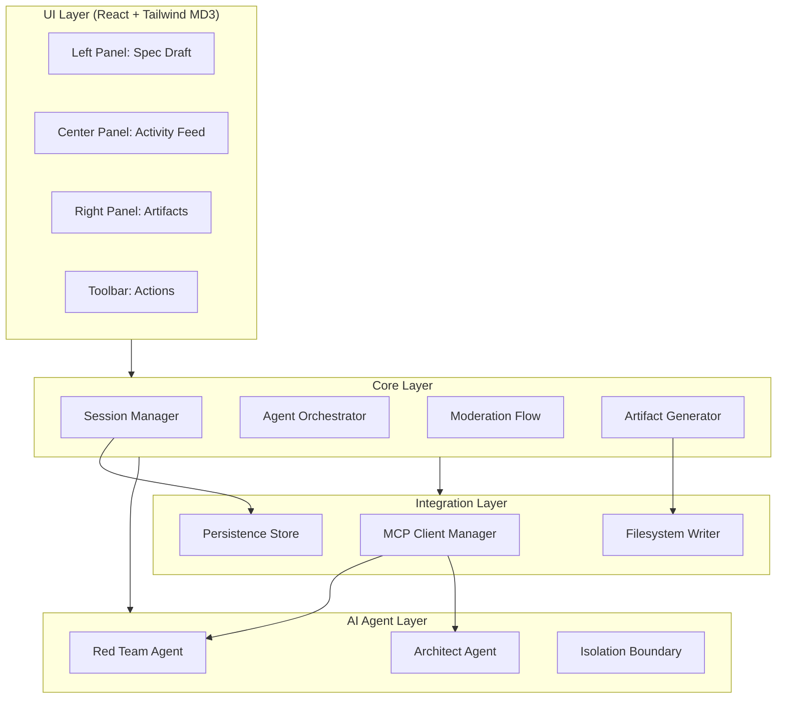

# Design Document: Spec Collider

## Overview

Spec Collider is a multiplayer collaborative workspace where humans and AI agents co-design software architecture through structured adversarial debate. The system orchestrates two isolated AI roles — a Red Team Agent (attack surface analysis) and an Architect Agent (mitigation design) — while a human moderator makes final decisions. The session produces exportable architecture artifacts synced to the local filesystem.

The application is a single-page web application with a three-panel layout (Spec Draft | Activity Feed | Artifacts), real-time streaming from AI agents, persistent session state, and integration with external context providers via the Model Context Protocol (MCP).

### Key Design Decisions

| Decision | Choice | Rationale |
|----------|--------|-----------|
| Runtime | TypeScript + Node.js | Full-stack type safety, strong async/streaming support |
| UI Framework | React 18 + Vite | Component model suits multi-panel layout; streaming-friendly |
| State Management | Zustand | Lightweight, supports subscriptions for real-time updates |
| Styling | Tailwind CSS with MD3 tokens | Maps directly to the Design System color tokens |
| AI Integration | OpenAI-compatible streaming API | Token-by-token streaming for Activity Feed |
| Persistence | IndexedDB (client-side) + filesystem sync | Offline-capable, no server dependency for MVP |
| MCP Client | Official MCP TypeScript SDK | Standard protocol support for context providers |
| Testing | Vitest + fast-check | Property-based and unit testing |

## Architecture



### Layered Architecture

1. **UI Layer**: React components implementing the three-panel layout with Material Design 3 token system. Responsible for rendering, user input capture, and streaming display.

2. **Core Layer**: Stateless business logic orchestrating sessions, agent invocations, moderation decisions, and artifact generation. Acts as the single coordination point.

3. **AI Agent Layer**: Isolated agent contexts with separate system prompts. Each agent receives only its own prompt + shared data (Spec Draft, Activity Feed). No cross-contamination.

4. **Integration Layer**: MCP client connections, IndexedDB persistence, and Node.js filesystem writes for artifact export.

## Components and Interfaces

### UI Components

```typescript
// Panel Layout
interface WorkspaceLayoutProps {
  sessionId: string;
  viewportWidth: number; // Determines 3-panel vs tabbed layout
}

// Spec Draft Panel (Left)
interface SpecDraftPanelProps {
  specDraft: SpecDraft;
  isStreaming: boolean;
}

// Activity Feed Panel (Center)
interface ActivityFeedPanelProps {
  entries: ActivityEntry[];
  onModerate: (mitigationId: string, action: ModerationAction) => void;
  connectionStatus: ConnectionStatus;
}

// Artifacts Panel (Right)
interface ArtifactsPanelProps {
  artifacts: Artifact[];
  selectedVersion?: number;
  onVersionSelect: (artifactId: string, version: number) => void;
}
```

### Core Services

```typescript
// Session Manager
interface ISessionManager {
  createSession(): Promise<Session>;
  loadSession(sessionId: string): Promise<Session>;
  saveSession(session: Session): Promise<void>;
  getSessionHistory(sessionId: string): Promise<SessionVersion[]>;
}

// Agent Orchestrator
interface IAgentOrchestrator {
  invokeRedTeam(context: AgentContext): AsyncGenerator<StreamChunk>;
  invokeArchitect(context: AgentContext): AsyncGenerator<StreamChunk>;
  invokeChaos(context: AgentContext): AsyncGenerator<StreamChunk>;
}

// Agent Context (isolation-aware)
interface AgentContext {
  systemPrompt: string;        // Agent-specific, never shared
  specDraft: SpecDraft;        // Current draft state
  activityHistory: ActivityEntry[]; // Shared feed
  mcpContext: MCPData[];       // External context from providers
}

// Moderation Flow
interface IModerationFlow {
  accept(mitigationId: string): Promise<SpecDraft>;
  reject(mitigationId: string, reason: string): Promise<void>;
  edit(mitigationId: string, modifiedText: string): Promise<SpecDraft>;
  checkConflict(mitigationId: string, specDraft: SpecDraft): ConflictResult;
}

// Artifact Generator
interface IArtifactGenerator {
  generateAll(session: Session): Promise<Artifact[]>;
  exportToFilesystem(artifacts: Artifact[], basePath: string): Promise<ExportResult>;
}

// MCP Client Manager
interface IMCPClientManager {
  connect(providerConfig: MCPProviderConfig): Promise<MCPConnection>;
  disconnect(connectionId: string): Promise<void>;
  getActiveConnections(): MCPConnection[];
  queryContext(connectionId: string, query: string): Promise<MCPData>;
}
```

### Event System

```typescript
// Central event bus for real-time updates
type WorkspaceEvent =
  | { type: 'idea_submitted'; payload: { text: string; timestamp: number } }
  | { type: 'spec_draft_generated'; payload: { draft: SpecDraft } }
  | { type: 'risk_identified'; payload: { risk: Risk; agentRole: 'red_team' } }
  | { type: 'mitigation_proposed'; payload: { mitigation: Mitigation; agentRole: 'architect' } }
  | { type: 'decision_made'; payload: { decision: ModerationDecision } }
  | { type: 'chaos_triggered'; payload: { timestamp: number } }
  | { type: 'artifact_generated'; payload: { artifact: Artifact } }
  | { type: 'mcp_status_changed'; payload: { connectionId: string; status: ConnectionStatus } }
  | { type: 'stream_chunk'; payload: { source: AgentRole; content: string } }
  | { type: 'error'; payload: { source: string; message: string; retryable: boolean } };
```

## Data Models

```typescript
// === Core Domain Models ===

interface Session {
  id: string;
  createdAt: number;
  updatedAt: number;
  specDraft: SpecDraft;
  activityFeed: ActivityEntry[];
  moderationHistory: ModerationDecision[];
  artifacts: VersionedArtifact[];
  mcpConnections: MCPConnectionState[];
  status: 'active' | 'finalized';
}

interface SpecDraft {
  overview: string;
  proposedArchitecture: string;
  dataModel: string;
  apiSurface: string;
  assumptions: string;
  lastModified: number;
  version: number;
}

interface Risk {
  id: string;
  title: string;
  category: 'scalability' | 'security' | 'reliability' | 'edge_case' | 'missing_assumption';
  severity: 'critical' | 'high' | 'medium' | 'low';
  description: string;
  affectedComponents: string[];
  evidence: string;
  isChaosRound: boolean;
  createdAt: number;
}

interface Mitigation {
  id: string;
  riskId: string;         // References the Risk it addresses
  riskTitle: string;      // Denormalized for display
  responseType: 'fix' | 'trade_off' | 'accepted_risk';
  description: string;
  technologies: string[]; // Specific tech/patterns proposed
  tradeOffs: string[];    // Stated negative consequences (for trade_off type)
  mcpEvidence?: string;   // Context Provider citations
  createdAt: number;
}

interface ModerationDecision {
  id: string;
  mitigationId: string;
  action: 'accepted' | 'rejected' | 'edited';
  reason?: string;          // Required for rejection
  modifiedText?: string;    // For edited decisions
  specDraftSectionModified: string;
  timestamp: number;
}

interface ActivityEntry {
  id: string;
  type: 'idea_submitted' | 'risk_identified' | 'mitigation_proposed' | 'decision_made' | 'chaos_triggered';
  contributor: 'user' | 'red_team_agent' | 'architect_agent';
  content: string;
  timestamp: number;
  metadata: Record<string, unknown>;
  streamComplete: boolean;
  mcpGrounded: boolean;
  partiallyGrounded: boolean;
  unavailableProviders: string[];
}

// === Artifact Models ===

interface Artifact {
  id: string;
  type: 'requirements' | 'design' | 'tasks' | 'adr' | 'steering_rules';
  content: string;
  generatedAt: number;
}

interface VersionedArtifact {
  artifactId: string;
  type: Artifact['type'];
  versions: ArtifactVersion[]; // Up to 50 versions
  currentVersion: number;
}

interface ArtifactVersion {
  version: number;
  content: string;
  generatedAt: number;
}

// === MCP Models ===

interface MCPProviderConfig {
  id: string;
  name: string;
  uri: string;
  capabilities: string[];
}

interface MCPConnection {
  id: string;
  config: MCPProviderConfig;
  status: 'connected' | 'disconnected' | 'error' | 'connected_no_data';
  connectedAt?: number;
  lastError?: string;
}

interface MCPConnectionState {
  connectionId: string;
  providerName: string;
  status: MCPConnection['status'];
}

interface MCPData {
  providerId: string;
  providerName: string;
  data: Record<string, unknown>;
  retrievedAt: number;
}

// === Streaming Models ===

interface StreamChunk {
  content: string;
  done: boolean;
  source: AgentRole;
  timestamp: number;
}

type AgentRole = 'red_team_agent' | 'architect_agent';

// === Validation ===

interface ValidationResult {
  valid: boolean;
  error?: string;
}

interface ConflictResult {
  hasConflict: boolean;
  conflictingDecision?: ModerationDecision;
  affectedSection?: string;
}

// === Export ===

interface ExportResult {
  success: boolean;
  writtenFiles: string[];
  failedFiles: { path: string; error: string }[];
}

// === UI State ===

type ConnectionStatus = 'connected' | 'reconnecting' | 'disconnected';

type ModerationAction =
  | { type: 'accept' }
  | { type: 'reject'; reason: string }
  | { type: 'edit'; modifiedText: string };
```

## Correctness Properties

*A property is a characteristic or behavior that should hold true across all valid executions of a system — essentially, a formal statement about what the system should do. Properties serve as the bridge between human-readable specifications and machine-verifiable correctness guarantees.*

### Property 1: Input length validation

*For any* string input, the submission validator SHALL accept the input if and only if its character length is between 10 and 5000 inclusive; inputs outside this range SHALL be rejected with a validation error containing the allowed length bounds.

**Validates: Requirements 1.1**

### Property 2: SpecDraft structural completeness

*For any* generated SpecDraft object, it SHALL contain all five required sections (overview, proposedArchitecture, dataModel, apiSurface, assumptions) and each section SHALL be a non-empty string.

**Validates: Requirements 1.3**

### Property 3: Input preservation on generation failure

*For any* submitted input text and any generation failure scenario, the workspace state SHALL preserve the original input text unchanged, enabling retry without re-entry.

**Validates: Requirements 1.5**

### Property 4: Red Team output exclusivity and structure

*For any* parsed output from the Red Team Agent, every item SHALL conform to the Risk interface (containing valid title, category ∈ {scalability, security, reliability, edge_case, missing_assumption}, severity ∈ {critical, high, medium, low}, description, affectedComponents, and evidence) and no item SHALL conform to the Mitigation interface.

**Validates: Requirements 2.2, 10.3**

### Property 5: Chaos round labeling

*For any* Risk produced during a chaos round invocation, the isChaosRound field SHALL be true; for any Risk produced during a standard invocation, the isChaosRound field SHALL be false.

**Validates: Requirements 2.5**

### Property 6: Architect output exclusivity and structure

*For any* parsed output from the Architect Agent, every item SHALL conform to the Mitigation interface (containing a valid riskId, riskTitle, responseType ∈ {fix, trade_off, accepted_risk}, description, and technologies array) and no item SHALL conform to the Risk interface.

**Validates: Requirements 3.2, 10.4**

### Property 7: Mitigation grouping by Risk

*For any* list of Mitigations displayed in the Activity Feed, the grouping function SHALL produce groups where every Mitigation within a group shares the same riskId, and no two groups contain Mitigations with the same riskId.

**Validates: Requirements 3.4**

### Property 8: Accept state transition

*For any* valid Mitigation and current SpecDraft, accepting the Mitigation SHALL produce a new SpecDraft with the proposed change applied to the referenced section AND add a ModerationDecision with action='accepted', the correct mitigationId, and a timestamp to the session history.

**Validates: Requirements 4.2**

### Property 9: Reject validation and state preservation

*For any* rejection reason string, if the length is between 1 and 1000 inclusive, the rejection SHALL be recorded in the session history and the SpecDraft SHALL remain unchanged; if the length is outside this range (0 or >1000), the rejection SHALL be prevented with a validation error.

**Validates: Requirements 4.3**

### Property 10: Edit validation and application

*For any* edit text string, if the length is between 1 and 5000 inclusive and the user confirms, the edited text SHALL be applied to the SpecDraft; if the length exceeds 5000, the edit SHALL be rejected with a validation error.

**Validates: Requirements 4.4**

### Property 11: Moderation decision creates correct ActivityEntry

*For any* ModerationDecision, the resulting ActivityEntry SHALL have type='decision_made', contributor='user', and metadata containing the decision action (accepted/rejected/edited) and the mitigationId reference.

**Validates: Requirements 4.5**

### Property 12: Cancel preserves state

*For any* SpecDraft state and any in-progress moderation operation (edit or rejection), canceling the operation SHALL result in the SpecDraft being byte-for-byte identical to its state before the operation was initiated and the Mitigation controls returning to their initial state.

**Validates: Requirements 4.6**

### Property 13: Conflict detection

*For any* two Mitigations that reference the same SpecDraft section, if the first Mitigation has been accepted (modifying that section), then attempting to accept or apply the second Mitigation SHALL produce a ConflictResult with hasConflict=true and the conflictingDecision referencing the first decision.

**Validates: Requirements 4.7**

### Property 14: Activity Feed chronological ordering and time formatting

*For any* list of ActivityEntries, the feed SHALL display them in strictly ascending timestamp order. For any entry timestamp less than 24 hours from the current time, the formatter SHALL produce a relative time string; for any entry timestamp 24 hours or older, the formatter SHALL produce a string in YYYY-MM-DD HH:MM format.

**Validates: Requirements 5.1**

### Property 15: Contributor identity consistency

*For any* set of ActivityEntries within a single session, all entries from the same contributor role SHALL map to the same color token and avatar icon. The three contributor roles (user, red_team_agent, architect_agent) SHALL each map to distinct, non-overlapping color tokens.

**Validates: Requirements 5.2, 10.5**

### Property 16: Valid entry action types

*For any* ActivityEntry in the feed, the type field SHALL be one of: 'idea_submitted', 'risk_identified', 'mitigation_proposed', 'decision_made', 'chaos_triggered'.

**Validates: Requirements 5.4**

### Property 17: Finalize precondition

*For any* Session, the "Finalize Spec" operation SHALL proceed only if the session's moderationHistory contains at least one ModerationDecision with action='accepted'. If no accepted decisions exist, finalize SHALL be rejected.

**Validates: Requirements 6.1**

### Property 18: Artifact generation completeness

*For any* set of accepted ModerationDecisions in a finalized session: the requirements.md artifact SHALL reference all accepted requirements; the design.md artifact SHALL incorporate all accepted mitigations; the tasks.md artifact SHALL contain at least N tasks for N accepted mitigations; the adr.md artifact SHALL contain one ADR entry per trade-off decision (accepted or rejected).

**Validates: Requirements 6.2, 6.3, 6.4, 6.5**

### Property 19: Artifact filesystem routing

*For any* Artifact, the export path function SHALL route artifacts of type 'steering_rules' to the .kiro/steering/ directory and all other artifact types (requirements, design, tasks, adr) to the .kiro/specs/ directory.

**Validates: Requirements 6.7**

### Property 20: Version history cap

*For any* VersionedArtifact, the versions array SHALL never contain more than 50 entries. When a 51st version is added, the oldest version SHALL be evicted to maintain the cap.

**Validates: Requirements 7.3**

### Property 21: Save retry logic

*For any* sequence of consecutive save failures, the system SHALL retry up to exactly 3 times. After the 3rd failure, no further automatic retries SHALL occur and a persistent error notification SHALL be triggered.

**Validates: Requirements 7.4, 7.5**

### Property 22: Responsive layout breakpoint

*For any* viewport width, if the width is 1280 pixels or above, the workspace SHALL render three simultaneous panels each with a minimum width of 300 pixels; if the width is below 1280 pixels, the workspace SHALL render a single-panel tabbed view.

**Validates: Requirements 8.5, 8.6**

### Property 23: MCP connection cap

*For any* number N of simultaneous MCP connection attempts, the system SHALL allow connections if the current active count is below 5 and reject the connection with an appropriate error if allowing it would exceed 5 simultaneous connections.

**Validates: Requirements 9.1**

### Property 24: Provider unavailability labeling

*For any* ActivityEntry produced while one or more Context_Providers are unavailable (failed or dropped mid-analysis), the entry SHALL have its unavailableProviders array populated with the names of the unavailable providers and SHALL be marked as partially grounded.

**Validates: Requirements 9.4, 9.6**

### Property 25: MCP connect/disconnect preserves session state

*For any* Session state, connecting or disconnecting a Context_Provider SHALL not modify the existing specDraft, activityFeed entries, or moderationHistory. Only the mcpConnections array SHALL change.

**Validates: Requirements 9.5**

### Property 26: No-data provider status

*For any* MCPConnection where the connected provider returns no usable data, the connection status SHALL be set to 'connected_no_data' rather than 'connected' or 'error'.

**Validates: Requirements 9.7**

### Property 27: Agent context isolation

*For any* agent invocation (Red Team or Architect), the constructed AgentContext SHALL contain only that agent's own system prompt, the current specDraft, the activityHistory, and mcpContext. The other agent's system prompt, internal reasoning, or configuration SHALL NOT appear anywhere in the context payload.

**Validates: Requirements 10.2**

### Property 28: Prompt injection resistance

*For any* activityHistory content — including strings that contain patterns resembling system prompt overrides, role reassignment instructions, or jailbreak attempts — the agent's systemPrompt field in the constructed AgentContext SHALL remain byte-for-byte identical to the original configured system prompt for that role.

**Validates: Requirements 10.6**

## Error Handling

### Error Categories

| Category | Example Scenarios | Strategy |
|----------|-------------------|----------|
| Input Validation | Text too short/long, invalid chars | Synchronous rejection with field-level error messages |
| AI Generation Failure | Timeout (30s), malformed output, network error | Error indicator in Activity Feed + "Retry" action |
| Filesystem Write Failure | Permission denied, disk full, path conflict | Per-file error message + "Retry Export" action |
| Session Persistence Failure | IndexedDB unavailable, quota exceeded | Auto-retry (3 attempts, 5s interval) → persistent notification |
| MCP Connection Failure | Provider unreachable, auth failure, mid-analysis drop | Graceful degradation: continue with reduced context + label affected entries |
| Conflict Detection | Accept targets already-modified section | Block action, notify user, require re-review |

### Error Recovery Patterns

1. **Retry with Backoff**: AI agent failures and persistence failures use automatic retry with the user informed of each attempt.
2. **Graceful Degradation**: MCP failures never block the session. Agents proceed with available context and label output as partially grounded.
3. **State Preservation**: All errors preserve the current state. No partial writes corrupt the session. Input text is always recoverable.
4. **User Agency**: Every retryable error exposes a manual "Retry" action so the user is never stuck waiting for automation.

### Error Display

- **Field-level**: Validation errors appear inline adjacent to the input control.
- **Feed-level**: Agent failures and MCP issues appear as labeled entries in the Activity Feed with the Error Container color token (`#FFDAD6` background, `#93000A` text).
- **Banner-level**: Persistent notifications (failed saves, connection loss) appear as sticky banners at the top of the workspace.

## Testing Strategy

### Dual Testing Approach

This feature uses both unit tests and property-based tests for comprehensive coverage.

**Property-Based Testing (PBT)**:
- Library: `fast-check` (TypeScript)
- Minimum 100 iterations per property
- Each test tagged with: `Feature: spec-collider, Property {N}: {title}`
- Targets: validation logic, state transitions, data structure invariants, agent context construction, routing functions

**Unit Tests (Example-Based)**:
- Library: `vitest`
- Targets: UI rendering, specific integration scenarios, error path examples, streaming behavior
- Focus on concrete scenarios that demonstrate correct behavior at integration points

### Test Organization

```
tests/
├── properties/             # Property-based tests (fast-check)
│   ├── validation.prop.ts      # Properties 1, 9, 10
│   ├── spec-draft.prop.ts      # Properties 2, 3
│   ├── agent-output.prop.ts    # Properties 4, 5, 6
│   ├── moderation.prop.ts      # Properties 7, 8, 11, 12, 13
│   ├── activity-feed.prop.ts   # Properties 14, 15, 16
│   ├── artifacts.prop.ts       # Properties 17, 18, 19, 20
│   ├── persistence.prop.ts     # Property 21
│   ├── layout.prop.ts          # Property 22
│   ├── mcp.prop.ts             # Properties 23, 24, 25, 26
│   └── isolation.prop.ts       # Properties 27, 28
├── unit/                   # Example-based unit tests
│   ├── components/         # React component tests
│   ├── services/           # Service logic tests
│   └── integration/        # Cross-service integration
└── setup.ts                # Test utilities and generators
```

### Generator Strategy

Property tests require generators for domain objects. Key generators:

- `arbInputText(minLen, maxLen)` — arbitrary strings within length bounds
- `arbSpecDraft()` — valid SpecDraft with all sections populated
- `arbRisk()` — valid Risk with random but valid enum values
- `arbMitigation(riskId?)` — valid Mitigation referencing a Risk
- `arbModerationDecision()` — valid decision with random action type
- `arbActivityEntry()` — valid entry with random contributor and type
- `arbSession()` — full session with random but consistent state
- `arbAgentContext(role)` — valid context for a specific agent role
- `arbMCPConnection()` — valid connection with random status
- `arbViewportWidth()` — integer in realistic range (320–3840)

### Coverage Goals

- All 28 correctness properties implemented as PBT tests (100+ iterations each)
- Unit tests for all UI components (render + interaction)
- Integration tests for streaming pipeline, persistence round-trip, and filesystem export
- Edge cases covered by generator diversity (empty strings, max-length strings, unicode, concurrent operations)

